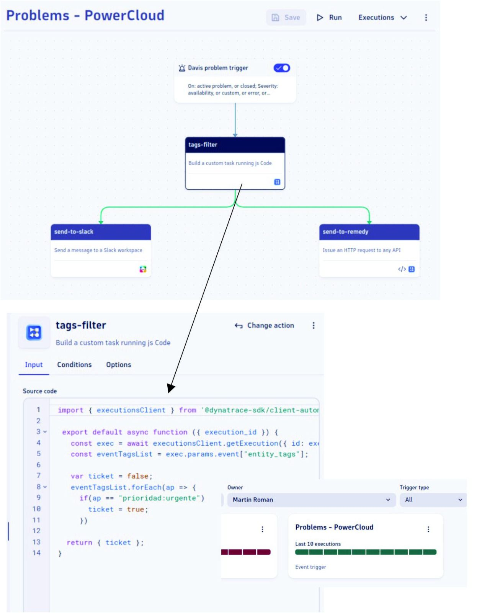

# Automatización de Incidentes con Dynatrace

Recientemente implementamos un **workflow avanzado en #Dynatrace** diseñado para transformar la manera en que un cliente responde ante eventos críticos. El objetivo era claro: reducir el MTTR (Mean Time To Resolution) eliminando la intervención manual en la apertura de tickets.

## La Solución: Filtrado Inteligente y Respuesta Multi-canal

Nuestra solución incluyó un mecanismo de **filtrado avanzado** que analiza las etiquetas (tags) de los eventos en tiempo real. Al detectar tags específicos, el workflow dispara una serie de acciones automáticas:

1.  **BMC Remedy:** Generación automática de tickets con toda la información de contexto del problema.
2.  **Slack:** Notificación inmediata a los canales de guardia para una comunicación efectiva y rápida coordinación.

## Arquitectura de Alta Disponibilidad: EdgeConnect

Para garantizar que este flujo de automatización sea infalible, la solución fue implementada utilizando **Dynatrace EdgeConnect**. 

Diseñamos una arquitectura robusta que incluye:
* **Tres instancias de EdgeConnect:** Configuradas para garantizar alta disponibilidad (HA).
* **Rendimiento constante:** Balanceo de carga para asegurar que ninguna integración sufra retardos durante picos de incidentes.

> Esta estrategia demuestra cómo **#Dynatrace** se adapta a las necesidades específicas de organizaciones complejas, maximizando la eficiencia operativa a través de la automatización inteligente.

---

### ¿Necesitás potenciar tu observabilidad?
Si buscás profundizar en integraciones de la plataforma Dynatrace o optimizar tus flujos de trabajo, no dudes en comunicarte con nosotros en **#Powercloud**. ¡Estamos para ayudarte!

